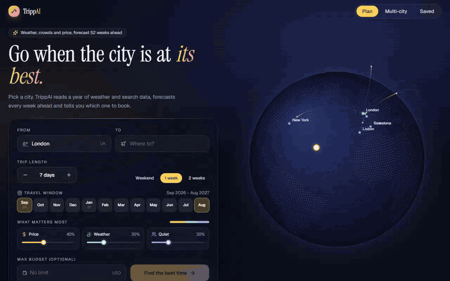
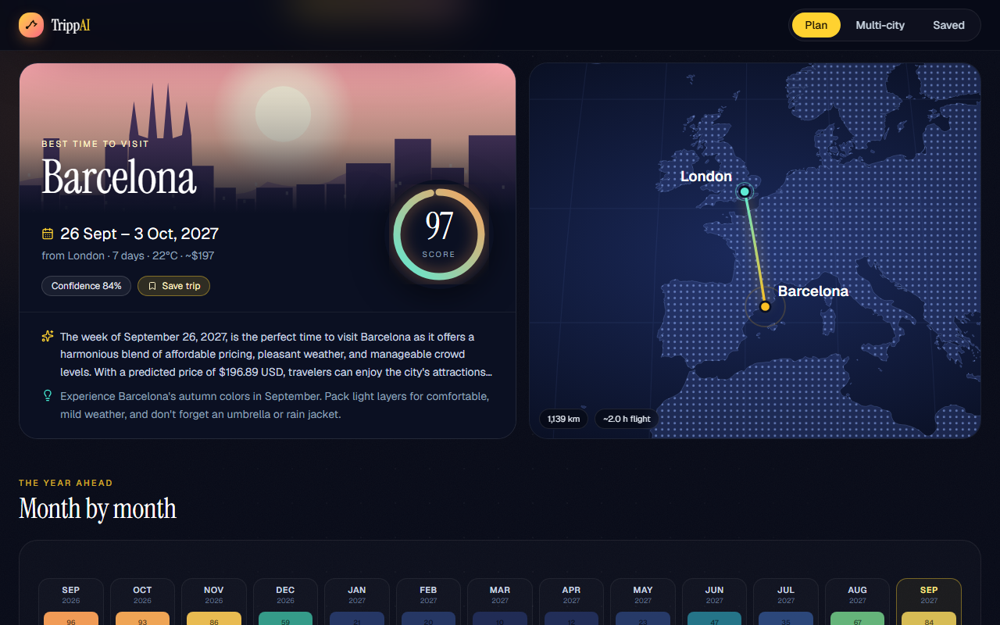
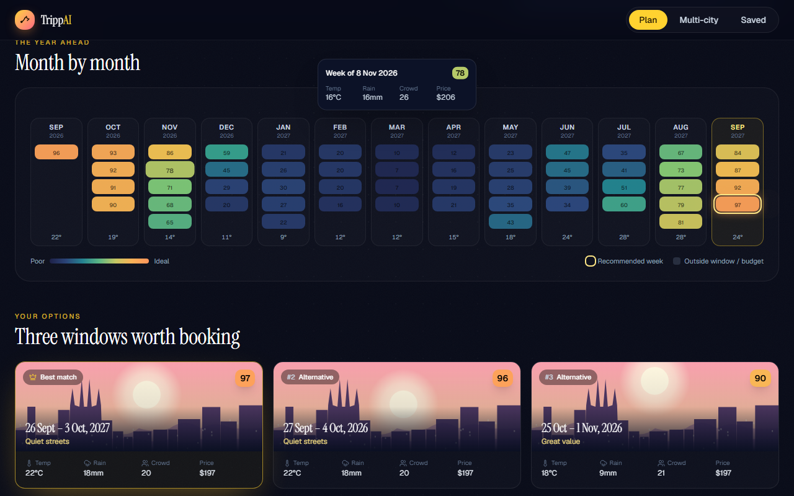
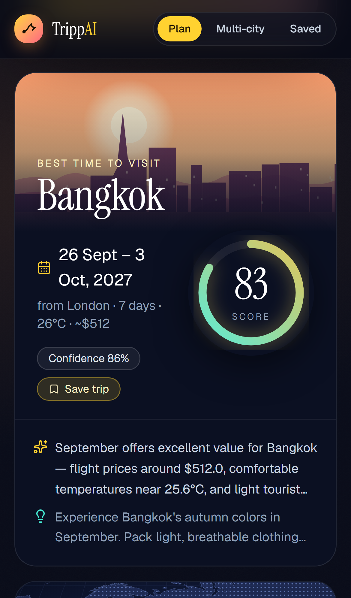
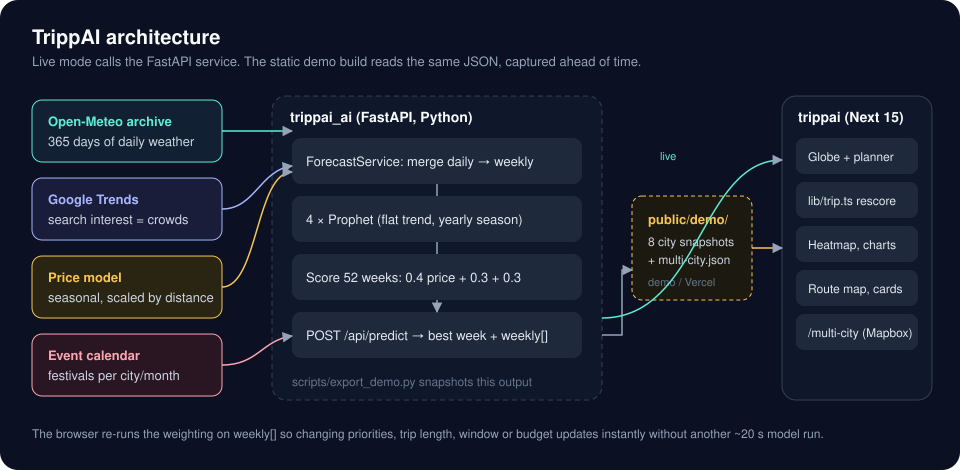
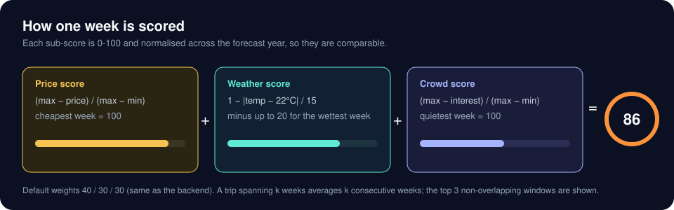

# TrippAI

Pick a city and TrippAI tells you which week of the next year to go, based on forecast weather, crowds and price.

Live demo: https://trippai.vercel.app/
Pitch deck: https://www.canva.com/design/DAG3HXMX9zY/BQ7X4mA8i0Rtu91yGmdx4Q/view?utm_content=DAG3HXMX9zY&utm_campaign=designshare&utm_medium=link2&utm_source=uniquelinks&utlId=h594a2d1409



[Full-quality video (MP4)](docs/media/demo.mp4)

## What it does

- **Destination search** with autocomplete and keyboard navigation. The globe turns to show the route while you type.
- **Planning inputs**: trip length, a travel window (pick a start and end month), how much you care about price, weather and quiet, and an optional budget.
- **Month-by-month heatmap** of every forecast week, coloured by score. The recommended week is outlined, and hovering a cell shows its temperature, rain, crowd index and price.
- **Three booking windows**: the best non-overlapping trips, each on an illustrated postcard.
- **Weather, crowd and price charts** that draw in as you scroll, with one crosshair shared by all three.
- **Score breakdown** showing the weighted sum. Drag a weight and the heatmap, cards and recommendation update straight away.
- **Route map** with an animated great-circle flight arc, the distance and a rough flight time.
- **Events** for the destination, a saved-trips page, and a multi-city planner (`/multi-city`, which uses a Mapbox map).

| Results | Heatmap | Mobile |
| --- | --- | --- |
|  |  |  |

## How it works



1. The backend (`trippai_ai/`, FastAPI) pulls a year of daily history for the city: weather from the Open-Meteo archive, search interest from Google Trends (used as a proxy for crowds), and a seasonal price series. The price series is synthetic, and its baseline is scaled by flight distance from the origin.
2. The daily data is merged, grouped into weeks, and each signal gets its own Prophet model (flat trend, yearly seasonality), which forecasts 52 weeks ahead.
3. Every forecast week is scored, and `/api/predict` returns the best week, an explanation, events, and the full `weekly[]` series.
4. The frontend (`trippai/`, Next.js 15, Framer Motion, d3-geo) runs the same weighting again in `lib/trip.ts`. Changing priorities, trip length, travel window or budget is instant because it doesn't trigger another model run, which takes about 20 seconds.



## Demo mode (static build)

The static build doesn't call any API. `python trippai_ai/scripts/export_demo.py` runs the real pipeline for 8 cities (Barcelona, Tokyo, Lisbon, New York, Rome, Bangkok, Paris and Sydney, all from London) plus one multi-city plan, and writes the results to `trippai/public/demo/*.json`. When `NEXT_PUBLIC_DEMO_MODE=true`, the frontend reads those files instead of the API, and the footer says it is showing demo data. In demo mode, other cities appear in the search list but are greyed out as "live only".

```bash
cd trippai
npm install
npm run build:demo      # static export -> trippai/out/
npx http-server out     # or any static host
```

On Vercel, set Root Directory to `trippai`, Build Command to `npm run build:demo`, and Output Directory to `out`. No environment variables are needed. `NEXT_PUBLIC_MAPBOX_TOKEN` is optional and only used by the `/multi-city` map.

## Quick start (live mode)

Backend (Python 3.12):

```bash
cd trippai_ai
pip install -r requirements.txt
cp .env.example .env            # optional keys: RAPIDAPI_KEY (Booking.com prices), EVENTBRITE_API_KEY, OLLAMA_*
python main.py                  # http://localhost:8000, docs at /docs (PORT env var to change)
```

Frontend (Node 20+):

```bash
cd trippai
cp .env.example .env.local      # NEXT_PUBLIC_API_URL=http://localhost:8000
npm install                     # .npmrc sets legacy-peer-deps
npm run dev                     # http://localhost:3000
```

The backend runs without any keys. If `RAPIDAPI_KEY` is missing it uses synthetic prices. If Ollama isn't running it uses template explanations. If Google Trends rate-limits the request (HTTP 429, which is common) it falls back to a seasonal crowd curve.

## Project layout

```
trippai/                    Next.js frontend
  app/page.tsx              landing, planner, results
  app/multi-city/           multi-city planner (Mapbox)
  components/trip/          Globe, CitySearch, Planner, Heatmap, TrendCharts,
                            ScoreBreakdown, RouteMap, WindowCards, Postcard, LoadingState
  lib/trip.ts               client-side scoring, windows, month grouping
  lib/api.ts                live API vs demo snapshots
  public/demo/              pre-computed model output for the static build
trippai_ai/                 FastAPI backend
  main.py                   endpoints
  services/                 weather, crowd, price, forecast (Prophet), events, booking
  models/trip_time_ai.py    prediction pipeline and output shaping
  multi_city_planner.py     route and day allocation across cities
  scripts/export_demo.py    writes the demo snapshots
docs/media/                 demo gif/mp4, screenshots, diagrams
```

## Design notes

- **Scoring runs twice on purpose.** The server still chooses the best week, so the API is useful without the UI. The client repeats the same arithmetic on `weekly[]`, which is what makes the priority sliders respond instantly.
- **Flat-trend Prophet.** With only one year of history, Prophet's default linear trend extrapolated the drift of a single year, so forecast temperatures kept falling. A flat trend with yearly seasonality is the honest model for this much data.
- **Prices are modelled, not quoted.** Weekly prices come from a seasonal model scaled by distance. `RAPIDAPI_KEY` only adds a Booking.com price check for the chosen week.
- **Maps don't need a token.** The globe and route map are drawn with d3-geo and the bundled `world-atlas` topology, so the static build works offline. Only the older multi-city page uses Mapbox.

Fixes made along the way: the date join between price and weather data never matched, so every city got a flat 20 °C with no rain. The weather service fell back to Paris for any city outside a list of 10. The rain penalty was inverted. Mock events carried the wrong year. And on Windows consoles, emoji in log output turned every prediction into an HTTP 500.
